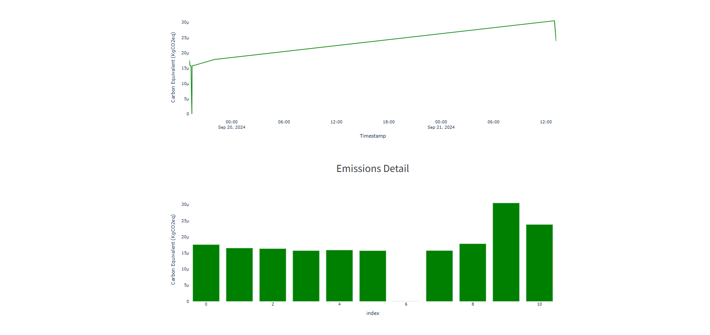

# Model Card for Crop Classification Model

## Overview

This model card provides essential information about the **Crop Classification Model** trained on the **Crop Classification Dataset**. The model predicts the best crop to plant based on environmental and soil data.

### Key Information:

- **Model Type**: RandomForestClassifier
- **Version**: 1.0
- **Input Features**: 7 numerical input features (Nitrogen, Phosphorus, Potassium, Temperature, Humidity, pH, Rainfall)
- **Output**: Predicted crop category

---

## Model Description

### 1. **Objective**

The objective of this model is to assist farmers and agricultural professionals in choosing the best crop to plant based on soil and environmental conditions.

### 2. **Input**

The model accepts the following input features:

| Feature     | Description                       | Units |
| ----------- | --------------------------------- | ----- |
| Nitrogen    | Nitrogen content in the soil      | kg/ha |
| Phosphorus  | Phosphorus content in the soil    | kg/ha |
| Potassium   | Potassium content in the soil     | kg/ha |
| Temperature | Temperature of the region         | °C    |
| Humidity    | Humidity level in the region      | %     |
| pH Value    | Acidity or alkalinity of the soil | pH    |
| Rainfall    | Rainfall in the region            | mm    |

### 3. **Output**

The output of the model is a **predicted crop type**. The model outputs a recommended crop such as:

- Rice
- Maize
- Cotton
- Coffee
- Jute
- Coconut
- Papaya
- Orange
- Apple
- Muskmelon
- Watermelon
- Grapes
- Mango
- Banana
- Pomegranate
- Lentil
- Blackgram
- MungBean
- MothBeans
- PigeonPeas
- KidneyBeans
- ChickPea

---

## Model Architecture

- **Algorithm**: RandomForestClassifier
- **Training Data Size**: 1760
- **Hyperparameters**: Default parameters were used, including `n_estimators=50`, `max_depth=2`,`min_samples_splits=5` and `random_state=42`.
- **Model Training**: The model was trained using Random Forest with an 80-20 train-test split.

---

## Performance Metrics

The model was evaluated on the test set using the following metrics:

| Metric    | Value              |
| --------- | ------------------ |
| Accuracy  | 0.725              |
| Precision | 0.8527403002240664 |
| Recall    | 0.725              |
| F1-Score  | 0.6601909594187447 |

---

## Fairness and Bias

- **Class Imbalance**: Some crop types are underrepresented in the training data, which may lead to biased predictions. Consider rebalancing the dataset if deploying in production.
- **Geographical Bias**: The model was trained on data from specific regions and may not generalize well to new, unseen regions.

---

## Model Limitations

- **Data Drift**: The model is sensitive to data drift caused by changing environmental conditions. We recommend monitoring data drift using Alibi Detect to ensure the model’s predictions remain accurate over time.
- **Outliers**: The model may perform poorly if provided with extreme or outlier values for input features such as temperature or rainfall.

---

## Model Use Case

- **Intended Use**: This model is intended to assist farmers in identifying the most suitable crop to grow, based on current soil and environmental factors.
- **Out of Scope**: This model should not be used for precise crop yield predictions or in regions that are not represented in the dataset.

---

## Ethical Considerations

- **Fairness**: Ensure that the model does not disproportionately benefit or disadvantage certain groups (e.g., small-scale farmers, certain regions).
- **Data Privacy**: Use anonymized data if deploying in a real-world setting to protect personal or sensitive information.

## Code Carbon

We use Code Carbon to monitor the environmental impact of running our machine learning models. Below, we present a detailed overview of the carbon emissions and energy consumption associated with specific model executions.

| Timestamp           | Project Name | Duration          | Emissions              | Emissions Rate         | CPU Power | GPU Power | RAM Power         |
| ------------------- | ------------ | ----------------- | ---------------------- | ---------------------- | --------- | --------- | ----------------- |
| 2024-09-19T19:09:24 | codecarbon   | 14.24550829999498 | 1.7599366653232822e-05 | 1.2354326909654057e-06 | 7.5       | 0.0       | 5.955403804779053 |

